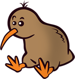
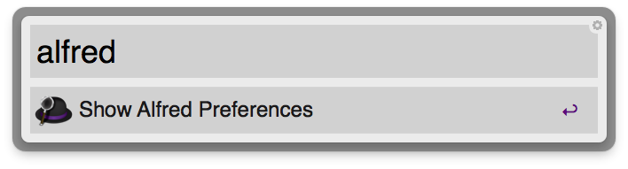
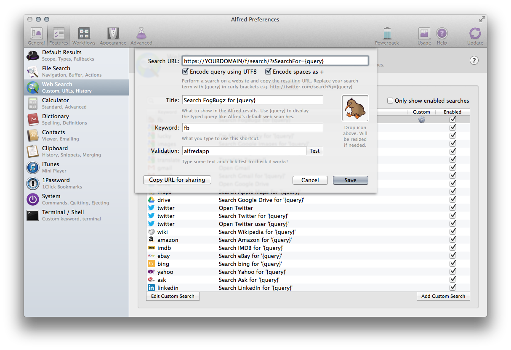
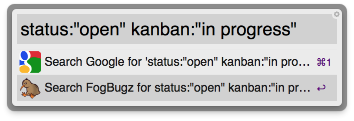

# Adding a custom search for FogBugz to Alfred

At JAKT we love using [FogBugz][fogbugz] by [FogCreek Software][fogcreek], the
same team that brought [Trello][trello] to life. Our every-day usage is
explained in more detail in our
[onboarding documentation](../internal/onboarding.html#fogbugzkiln).

We also highly recommend everyone use [Alfred][alfred], the [Quicksilver][qs]
replacement for application launching and [so much more][alfred features].
Alfred has a configurable set of [default searches][alfred default] one can
configure. It also has powerful [workflows][alfred workflows] but that's for a
later time.

Setting up a default search for FogBugz is simple.

### Step #1: Open Alfred's Preferences

You can open Alfred's preferences by typing "alfred" into the query bar or by
hitting `Command+,` when the Alfred is toggled.

### Step #2: Adding A Custom Web Search

Features are additional features for Alfred. Here you configure the default
fallback and web searches among other things.

Before adding a default fallback you need to add it as a custom web search.

### Step #3: Adding A Custom Search

Click "Add Custom Search" to open the dialog for adding a new custom search to
Alfred.

I grabbed the FogBugz icon from the FogBugz website. Looks better that way. The
query url should look like:

    https://YOURDOMAIN/f/search/?sSearchFor={query}

For FogBugz On-Demand. If you're using [FogBugz for Your Server](http://www.fogcreek.com/fogbugz/for-your-server.html)
the url might be different. The important thing here is the `{query}` argument
that pipes whatever you type into Alfred into the search string.

### Step #4: Adding A Fallback Search

Open up the "Default Results" tab. This is for configuring a lot of Alfred's
default actions and behavior.

Fallback results are default searches Alfred can perform if no keyword or action
is being triggered.

Add FogBugz as a fallback option here. I've removed Amazon and Wikipedia and
left only Google and Fogbugz.

### Step #5: Try It Out

Type something in and give it a shot. It will use [FogBugz's search axis query][fogbugz search axis] so becoming familiar with that will help.

[fogcreek]: http://www.fogcreek.com/about/
[fogbugz]: http://www.fogcreek.com/fogbugz/
[fogbugz search axis]: https://help.fogcreek.com/7480/search-syntax-and-the-search-axis
[trello]: https://trello.com
[alfred]: http://www.alfredapp.com
[alfred features]: http://www.alfredapp.com/#features
[alfred default]: http://support.alfredapp.com/features:default-results
[alfred workflows]: http://support.alfredapp.com/workflows/
[qs]: http://qsapp.com